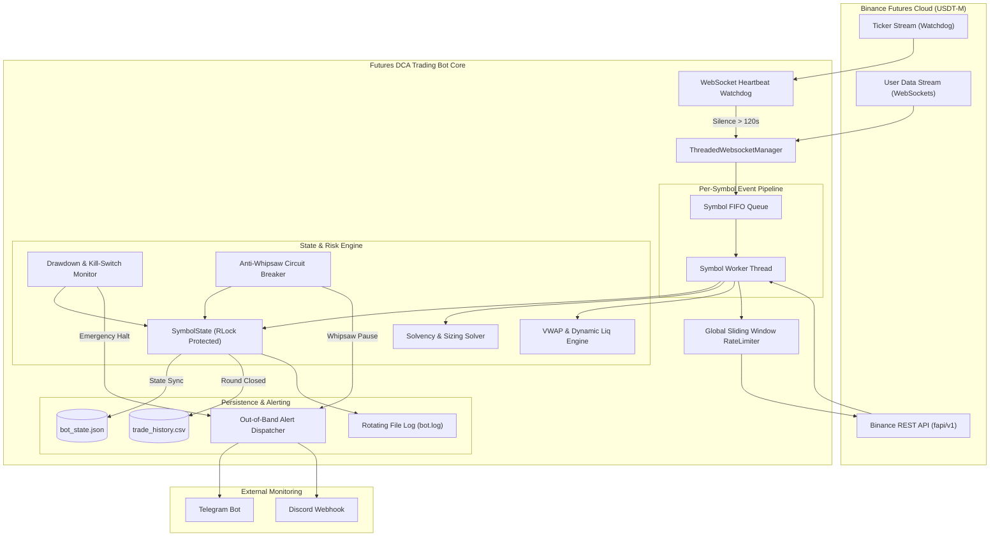
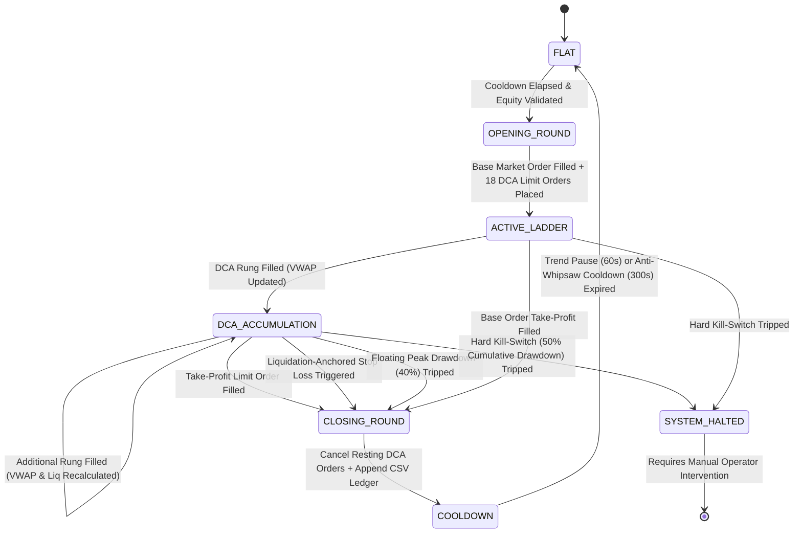
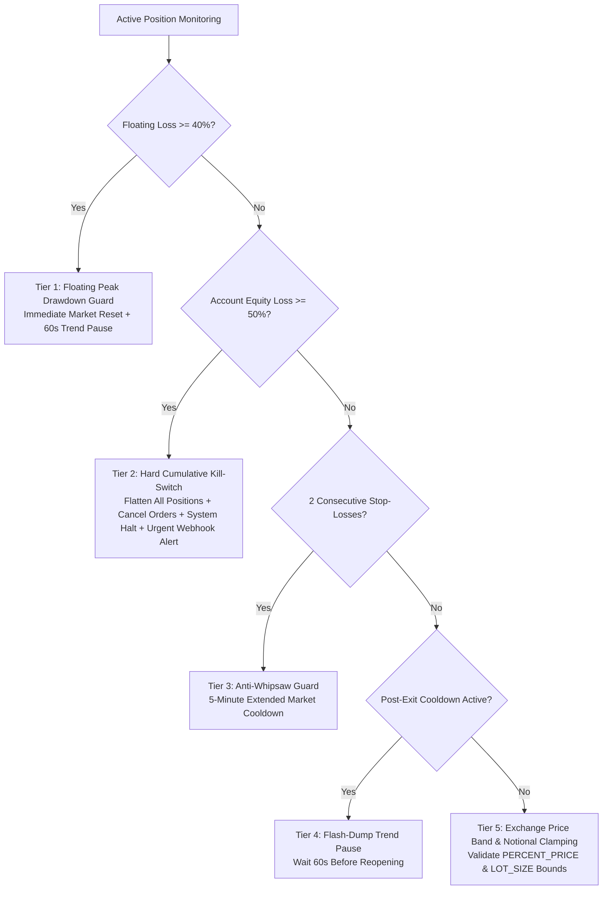

# Futures DCA Trading Bot

[](https://www.python.org/)
[](https://opensource.org/licenses/MIT)
[](https://www.binance.com/en/futures)
[]()

An institutional-grade, fully autonomous algorithmic Dollar-Cost Averaging (DCA) trading system engineered specifically for high-frequency execution on **Binance USDT-M Perpetual Futures** (e.g. `SOLUSDT`, `BTCUSDT`, `ETHUSDT`).

The engine combines dynamic capital budgeting, geometric position scaling, volume-weighted average price (VWAP) recalculation, and a proprietary liquidation-anchored risk management architecture to capture consistent mean-reversion profits while safeguarding account capital against cascading flash crashes and black swan liquidation events.

---

## Table of Contents

1. [Key Architectural Highlights](#key-architectural-highlights)
2. [End-to-End System Architecture](#end-to-end-system-architecture)
3. [Finite State Machine & Round Lifecycle](#finite-state-machine--round-lifecycle)
4. [Mathematical Trading Model & Capital Budgeting](#mathematical-trading-model--capital-budgeting)
5. [Dynamic Liquidation-Anchored Stop Loss Engine](#dynamic-liquidation-anchored-stop-loss-engine)
6. [Directional Trading Modes & Trend Bias Engines](#directional-trading-modes--trend-bias-engines)
7. [Multi-Tier Risk Management & Emergency Circuit Breakers](#multi-tier-risk-management--emergency-circuit-breakers)
8. [Complete Configuration Parameter Reference](#complete-configuration-parameter-reference)
9. [Hardware, Software & Infrastructure Prerequisites](#hardware-software--infrastructure-prerequisites)
10. [Step-by-Step Installation & Setup Walkthrough](#step-by-step-installation--setup-walkthrough)
11. [Binance API Key Setup & Security Hardening](#binance-api-key-setup--security-hardening)
12. [Deployment & Production Hosting Options](#deployment--production-hosting-options)
13. [Binance Futures Testnet Verification Protocol](#binance-futures-testnet-verification-protocol)
14. [Observability, Persistence & Trade Analytics](#observability-persistence--trade-analytics)
15. [Out-of-Band Real-Time Alerting (Telegram & Discord)](#out-of-band-real-time-alerting-telegram--discord)
16. [Strategy Presets & Tuning Guide](#strategy-presets--tuning-guide)
17. [Quantitative Financial Modeling & Performance Scenarios](#quantitative-financial-modeling--performance-scenarios)
18. [Troubleshooting, Edge Cases & Operational FAQ](#troubleshooting-edge-cases--operational-faq)
19. [MIT License & Risk Disclaimer](#mit-license--risk-disclaimer)

---

## Key Architectural Highlights

* **Thread-Isolated REST Pipeline:** Each thread maintains its own dedicated `binance.client.Client` instance with thread-local storage (`threading.local`), preventing SSL session corruption and race conditions under heavy concurrent load.
* **Dual Event-Driven & REST Safety Net:** Market data and private account executions stream in real-time over WebSocket feeds (`ThreadedWebsocketManager`), while an asynchronous background polling loop reconciles state every 30 seconds to catch edge-case discrepancies.
* **FIFO Symbol Execution Queues:** Account updates and order fills are partitioned into per-symbol dedicated FIFO queues (`queue.Queue`) and processed by dedicated worker threads, ensuring strictly chronological event handling without head-of-line blocking across symbols.
* **Dynamic Solvency Budgeting Solver:** Before order #0 is submitted, the engine mathematically solves the 18-rung geometric series against available wallet equity to guarantee that the full averaging ladder can execute without exhausting margin or violating Binance leverage brackets.
* **Continuous Liquidation-Anchored SL:** Stop Loss triggers are anchored to the live exchange-calculated liquidation price (`futures_position_information()`), dynamically shifting as lower DCA rungs execute and guaranteeing market exit prior to liquidation penalties.
* **Debounced Protective Order Updates:** Rapid micro-fills coalesce via a 1.5-second debounce timer, preventing API weight exhaustion and IP bans during high-volatility bursts.
* **Sliding Window Rate Limiter:** An internal thread-safe token bucket rate limiter strictly enforces Binance IP call limits (max 2,000 weight per 60s window).
* **Automatic Clock Drift Sync:** Intercepts Binance Error `-1021` (`recvWindow`) and dynamically recalculates server time offset on the fly.
* **Fail-Safe Persistence:** Round counters, rolling peak equity baselines, and active trade directions persist across process restarts via `bot_state.json`.

---

## End-to-End System Architecture



---

## Finite State Machine & Round Lifecycle

Each traded symbol progresses through a deterministic finite state machine protected by re-entrant synchronization locks (`threading.RLock`):



### State Machine Lifecycle Stages:

1. **`FLAT`**: The symbol has zero open position and no resting orders. The watchdog verifies that the post-exit cooling timer (`cooldown_until`) has elapsed before requesting `open_round()`.
2. **`OPENING_ROUND`**: The bot queries account equity, executes the mathematical solvency equation, quantizes order sizes against `LOT_SIZE` / `MIN_NOTIONAL`, submits the initial base market order, and atomically places 18 resting limit orders along with conditional TP and SL orders.
3. **`ACTIVE_LADDER` / `DCA_ACCUMULATION`**: As market volatility triggers resting limit orders, WebSocket fill events recalculate the volume-weighted average price (VWAP) and live liquidation price. A debounced refresh task updates the resting Take Profit and Stop Loss levels.
4. **`CLOSING_ROUND`**: When an exit trigger fires (TP fill, SL trigger, or Drawdown threshold), the bot flattens any residual position, purges remaining limit orders from the book, logs performance metrics to `trade_history.csv`, and saves state to `bot_state.json`.
5. **`COOLDOWN`**: A mandatory trend cooling period (`TREND_PAUSE_SECONDS = 60`) prevents buying into cascading knives. If consecutive stops occurred, the anti-whipsaw guard extends cooldown to 300 seconds.
6. **`SYSTEM_HALTED`**: If cumulative losses breach 50% from all-time peak equity, trading halts permanently across all pairs, open positions are flattened, and urgent webhook alerts are broadcast.

---

## Mathematical Trading Model & Capital Budgeting

The core strategy executes a geometric Dollar-Cost Averaging grid designed to capture mean-reversion profits during cyclical market pullbacks.

### 1. Base Order Sizing Formulation

At the start of every round, base order margin is determined dynamically as a percentage of total allocated wallet equity:

$$	ext{Base\_Margin\_Target} = 	ext{Allocated\_Wallet\_Equity} 	imes \left(rac{	ext{BASE\_ORDER\_PCT\_OF\_ALLOCATION}}{100}
ight)$$

The computed margin is bounded by the exchange's minimum notional filter:

$$	ext{Min\_Required\_Margin} = rac{	ext{MIN\_NOTIONAL}}{	ext{LEVERAGE}}$$

$$	ext{Base\_Margin} = \max(	ext{Base\_Margin\_Target}, 	ext{Min\_Required\_Margin})$$

### 2. Geometric Martingale Averaging Ladder

Upon base order execution, the engine submits a ladder of 18 resting limit orders:

* **Arithmetic Price Grid Spacing:**
  * For **LONG** positions: $	ext{Price}_i = 	ext{Entry\_Price}_0 	imes \left(1 - rac{	ext{PRICE\_STEP\_PCT}}{100} 	imes i
ight)$
  * For **SHORT** positions: $	ext{Price}_i = 	ext{Entry\_Price}_0 	imes \left(1 + rac{	ext{PRICE\_STEP\_PCT}}{100} 	imes i
ight)$

* **Geometric Volume Progression ($1.1	imes$ Multiplier):**
  $$	ext{Margin}_i = 	ext{Base\_Margin} 	imes (	ext{ORDER\_SIZE\_MULTIPLIER}^i)$$
  $$	ext{Notional}_i = 	ext{Margin}_i 	imes 	ext{LEVERAGE}$$
  $$	ext{Quantity}_i = 	ext{quantize}\left(rac{	ext{Notional}_i}{	ext{Price}_i}, 	ext{step\_size}
ight)$$

### 3. Mathematical Solvency Guarantee & Leverage Bracket Clamp

To guarantee that all 18 DCA rungs can execute without running out of margin or exceeding Binance leverage bracket caps, the total ladder multiplier sum is solved:

$$	ext{Multiplier\_Sum} = \sum_{i=0}^{18} (1.10^i) = rac{1.10^{19} - 1}{1.10 - 1} pprox 51.159$$

$$	ext{Max\_Allowed\_Base\_Margin} = rac{	ext{Allocated\_Equity} 	imes 0.95}{	ext{Multiplier\_Sum}}$$

The engine strictly bounds $	ext{Base\_Margin} \le 	ext{Max\_Allowed\_Base\_Margin}$ before placing order #0, ensuring complete mathematical solvency across deep 18% market drawdowns.

### 4. Volume-Weighted Average Entry Price (VWAP)

Atomically updated on every partial or complete order fill:

$$	ext{VWAP} = rac{\sum_{k=1}^{n} (	ext{Fill\_Quantity}_k 	imes 	ext{Fill\_Price}_k)}{\sum_{k=1}^{n} 	ext{Fill\_Quantity}_k}$$

$$	ext{Total\_Position\_Quantity} = \sum_{k=1}^{n} 	ext{Fill\_Quantity}_k$$

### 5. Take Profit Mean-Reversion Target

Maintained on the exchange at a target offset relative to the dynamically moving VWAP:

* For **LONG** positions: $	ext{TP\_Price} = 	ext{VWAP} 	imes \left(1 + rac{	ext{TAKE\_PROFIT\_PCT}}{100}
ight)$
* For **SHORT** positions: $	ext{TP\_Price} = 	ext{VWAP} 	imes \left(1 - rac{	ext{TAKE\_PROFIT\_PCT}}{100}
ight)$

As market price drops and lower DCA rungs execute, VWAP shifts downward. This brings the Take Profit target closer to current market price, enabling profitable exits on minor technical bounces.

---

## Dynamic Liquidation-Anchored Stop Loss Engine

Traditional algorithmic trading bots rely on static percentage stop losses (e.g. fixed 40%). Under cross-margin accounting and dynamic position accumulation, static stops fail during volatility spikes—either triggering prematurely or resulting in exchange liquidation.

### Real-Time Liquidation Floating Formula

The engine continuously queries the live exchange-calculated liquidation price from Binance's `futures_position_information()` endpoint:

* For **LONG** positions:
  $$	ext{SL\_Trigger\_Price} = 	ext{Liquidation\_Price} 	imes \left(1 + rac{	ext{LIQUIDATION\_BUFFER\_PCT}}{100}
ight)$$
* For **SHORT** positions:
  $$	ext{SL\_Trigger\_Price} = 	ext{Liquidation\_Price} 	imes \left(1 - rac{	ext{LIQUIDATION\_BUFFER\_PCT}}{100}
ight)$$

Under the default configuration (`LIQUIDATION_BUFFER_PCT = 1.5%`), the stop loss order sits **1.5% above the actual liquidation price** for long positions. This guarantees that positions are closed via market order before exchange liquidation penalties, maintenance margin deficits, or insurance fund fees are incurred.

### Debounced Order Replacement

Every DCA fill shifts the liquidation price. To prevent API rate-limit exhaustion during rapid cascading fills, Take Profit and Stop Loss algo order replacements are debounced over a 1.5-second coalescing window (`TP_SL_REFRESH_DEBOUNCE_SECONDS = 1.5`).

---

## Directional Trading Modes & Trend Bias Engines

The bot supports three directional execution configurations:

| Mode | Configuration | Behavioral Characteristics | Optimal Market Regime |
| :--- | :--- | :--- | :--- |
| **`LONG_ONLY`** | `TRADING_MODE = "LONG_ONLY"` | Strictly buys dips and sells tops in the LONG direction. Eliminates short-squeeze risk. If Stop-Loss is hit, the next round resumes LONG after cooldown. | Macro Bull Markets, Staking Assets, Sideways Upward Drift |
| **`SHORT_ONLY`** | `TRADING_MODE = "SHORT_ONLY"` | Strictly opens SHORT rounds. Buys pullbacks to close. Eliminates long-cascade liquidation risk. | Macro Bear Markets, Structural Downtrends |
| **`BOTH`** | `TRADING_MODE = "BOTH"` | Trades bidirectionally. Can alternate between LONG and SHORT based on auto-flip triggers or moving average trend filters. | Ranging Volatile Regimes, Choppy Sideways Consolidation |

### Trend Filter & Auto-Flip Controls:
* **Auto-Flip on Stop-Loss (`ENABLE_AUTO_FLIP = True`):** Automatically reverses trading direction (`LONG` $\leftrightarrow$ `SHORT`) after a Stop-Loss is hit when in `BOTH` mode.
* **Moving Average Trend Filter (`USE_TREND_MA_FILTER = True`):** Queries 5-minute Kline candles and computes a 20-period Simple Moving Average (SMA). If current price is above 20-SMA, the next round opens `LONG`; if below, it opens `SHORT`.

---

## Multi-Tier Risk Management & Emergency Circuit Breakers



1. **Floating Equity Drawdown Guard (`MAX_DRAWDOWN_FROM_PEAK_PCT = 40.0%`):** Continuously monitors margin balance against rolling peak equity. If unrealized drawdown reaches 40%, the bot executes an immediate market exit to protect remaining capital and resets for a clean round.
2. **Hard Cumulative Account Kill-Switch (`HARD_KILL_SWITCH_DRAWDOWN_PCT = 50.0%`):** Permanent emergency shutdown. If total account equity drops 50% below all-time peak baseline, the kill-switch cancels all open orders, flattens all positions via multi-attempt market loops, dispatches an emergency webhook alert, and halts execution permanently.
3. **Anti-Whipsaw Choppy Market Guard (`ENABLE_ANTI_WHIPSAW_GUARD = True`):** If 2 consecutive Stop-Loss exits occur within a narrow window (`MAX_CONSECUTIVE_SL = 2`), trading is paused for 300 seconds (5 minutes) to protect against choppy, whipsawing market conditions.
4. **Flash-Dump Trend Pause (`TREND_PAUSE_SECONDS = 60`):** Enforces a mandatory 60-second cooling period following any Stop-Loss or Drawdown exit before opening a new round, preventing the bot from buying falling knives during panic selloffs.
5. **Exchange Price Band Clamping:** All limit order prices are validated against Binance `PERCENT_PRICE` and `PERCENT_PRICE_BY_SIDE` filters prior to submission to prevent exchange order rejections.

---

## Complete Configuration Parameter Reference

All operational parameters are defined at the top of `code.py` and can be customized:

| Parameter | Type | Default | Description |
| :--- | :--- | :--- | :--- |
| `API_KEY` | `str` | `""` | Binance API key (reads from `BINANCE_API_KEY` environment variable). |
| `API_SECRET` | `str` | `""` | Binance API secret (reads from `BINANCE_API_SECRET` environment variable). |
| `TESTNET` | `bool` | `True` | `True` connects to Binance Futures Testnet; `False` connects to Live Production. |
| `SYMBOLS` | `list[str]` | `["SOLUSDT"]` | List of target USDT-M perpetual contracts to trade simultaneously. |
| `LEVERAGE` | `int` | `2` | Position leverage multiplier (2x recommended for maximum safety and liquidation buffer). |
| `MARGIN_TYPE` | `str` | `"CROSSED"` | Margin mode: `"CROSSED"` (shared account wallet) or `"ISOLATED"` (isolated per position). |
| `ACCOUNT_ALLOCATION_FRACTION_PER_SYMBOL` | `float` | `1.0` | Fraction of total wallet balance allocated per symbol (`1.0` = 100% for single pair). |
| `USE_DYNAMIC_SIZING` | `bool` | `True` | `True` sizes base orders dynamically from live balance to compound profits automatically. |
| `BASE_ORDER_PCT_OF_ALLOCATION` | `float` | `2.0` | Base order margin as a percentage of allocated wallet equity (2.0%). |
| `BASE_ORDER_USDT` | `float` | `6.0` | Static fallback base order margin in USDT if dynamic sizing is disabled. |
| `PRICE_STEP_PCT` | `float` | `1.0` | Distance between each successive DCA averaging rung in percent (1.0% spacing). |
| `TAKE_PROFIT_PCT` | `float` | `1.0` | Target profit percentage above or below volume-weighted average entry price (1.0%). |
| `ORDER_SIZE_MULTIPLIER` | `float` | `1.1` | Geometric volume progression factor across DCA rungs ($1.1	imes$). |
| `MIN_DCA_ORDERS` | `int` | `18` | Total number of resting DCA limit averaging orders placed on exchange (18 rungs). |
| `TRADING_MODE` | `str` | `"LONG_ONLY"` | Trading bias: `"LONG_ONLY"`, `"SHORT_ONLY"`, or `"BOTH"`. |
| `ENABLE_AUTO_FLIP` | `bool` | `False` | When `TRADING_MODE="BOTH"`, `True` flips direction (`LONG` $\leftrightarrow$ `SHORT`) on Stop-Loss. |
| `INITIAL_DIRECTION` | `str` | `"LONG"` | Default starting bias on fresh startup when `TRADING_MODE="BOTH"`. |
| `USE_DYNAMIC_LIQUIDATION_SL` | `bool` | `True` | `True` anchors Stop-Loss to live exchange liquidation price. |
| `LIQUIDATION_BUFFER_PCT` | `float` | `1.5` | Safety buffer percentage before liquidation price (1.5% above liquidation for LONG). |
| `FALLBACK_STOP_LOSS_PCT` | `float` | `40.0` | Static fallback Stop-Loss percentage if liquidation price is unindexed. |
| `PROTECTIVE_ORDER_WORKING_TYPE` | `str` | `"CONTRACT_PRICE"` | Trigger price evaluation method: `"CONTRACT_PRICE"` (Last Price) or `"MARK_PRICE"`. |
| `MAX_DRAWDOWN_FROM_PEAK_PCT` | `float` | `40.0` | Floating drawdown limit from peak equity triggering market exit and cooldown. |
| `HARD_KILL_SWITCH_DRAWDOWN_PCT` | `float` | `50.0` | Cumulative drawdown from all-time peak triggering complete shutdown and liquidation. |
| `DRAWDOWN_BASIS` | `str` | `"EQUITY"` | Metric for drawdown tracking: `"EQUITY"` (includes unrealized PnL) or `"WALLET"`. |
| `TREND_PAUSE_SECONDS` | `int` | `60` | Post-exit cooling interval in seconds to avoid buying falling knives. |
| `ENABLE_ANTI_WHIPSAW_GUARD` | `bool` | `True` | Enables extended cooldown when consecutive Stop-Losses occur. |
| `MAX_CONSECUTIVE_SL` | `int` | `2` | Number of back-to-back Stop-Losses that trigger the whipsaw circuit breaker. |
| `WHIPSAW_COOLDOWN_SECONDS` | `int` | `300` | Cooldown duration during whipsaw market conditions (5 minutes). |
| `USE_TREND_MA_FILTER` | `bool` | `False` | When `TRADING_MODE="BOTH"`, uses 20-SMA on 5m candles to select round bias. |
| `POLL_INTERVAL_SECONDS` | `int` | `3` | REST polling interval when WebSocket stream is disconnected. |
| `RECONCILE_POLL_INTERVAL_SECONDS` | `int` | `30` | Safety-net REST state reconciliation interval while WebSocket is healthy. |
| `WATCHDOG_INTERVAL_SECONDS` | `int` | `20` | Main health check, idle detector, and state persistence interval. |
| `MAX_ROUND_OPEN_RETRIES` | `int` | `5` | Maximum failed order attempts before halting a symbol for operator safety. |
| `STATE_FILE` | `str` | `"bot_state.json"` | Path to local state JSON file persisting round numbers and peak equity. |
| `TRADE_HISTORY_FILE` | `str` | `"trade_history.csv"`| Path to local CSV performance ledger recording all completed rounds. |
| `RATE_LIMIT_MAX_CALLS` | `int` | `2000` | Maximum REST requests allowed per rolling period (Binance IP limit is 2400/min). |
| `RATE_LIMIT_PERIOD_SECONDS` | `float` | `60.0` | Rate limiter sliding window length in seconds. |
| `WS_HEARTBEAT_TIMEOUT_SECONDS` | `int` | `120` | Silence limit before forcing automatic WebSocket reconnection. |
| `TP_SL_REFRESH_DEBOUNCE_SECONDS` | `float` | `1.5` | Debounce window to coalesce rapid micro-fills into a single TP/SL update. |

---

## Hardware, Software & Infrastructure Prerequisites

* **Operating System:** Linux (Ubuntu 20.04/22.04/24.04, Debian 11/12), macOS Sonoma/Sequoia, or Windows 10/11.
* **Python Runtime:** Python `3.10`, `3.11`, or `3.12` (with `pip` and `venv` installed).
* **Network Infrastructure:** Low-latency internet connection to Binance API gateways. Dedicated cloud VPS hosting in **AWS Tokyo (`ap-northeast-1`)** or **AWS Singapore (`ap-southeast-1`)** is strongly recommended for sub-10ms execution latency.
* **Memory & Storage:** Minimum 512 MB RAM, 1 vCPU, and 500 MB free disk space for rotating log archives and CSV trade ledger.

---

## Step-by-Step Installation & Setup Walkthrough

### 1. Clone or Download the Project Directory

Ensure your directory contains `code.py`, `Requirements.txt`, and `.env.example`.

### 2. Create and Activate a Python Virtual Environment

* **On Linux / macOS:**
  ```bash
  python3 -m venv venv
  source venv/bin/activate
  ```

* **On Windows (PowerShell):**
  ```powershell
  python -m venv venv
  .env\Scripts\Activate.ps1
  ```

* **On Windows (Command Prompt):**
  ```cmd
  python -m venv venv
  .env\Scriptsctivate.bat
  ```

### 3. Install Required Dependencies

```bash
pip install --upgrade pip
pip install -r Requirements.txt
```

Verified core dependencies installed:
* `python-binance >= 1.0.37` (Binance REST & WebSocket client)
* `requests >= 2.28.0` (HTTP connection pool handler)

### 4. Configure Environment Variables

Copy the example template to create your active `.env` configuration file:

```bash
cp .env.example .env
```

Edit `.env` with your API credentials and webhook tokens:

```env
# Binance USDT-M Futures API Credentials
BINANCE_API_KEY=your_binance_api_key_here
BINANCE_API_SECRET=your_binance_api_secret_here

# Out-of-band Alerting (Optional but Recommended)
TELEGRAM_BOT_TOKEN=123456789:ABCdefGhIJKlmNoPQRsTUVwxyZ
TELEGRAM_CHAT_ID=987654321
WEBHOOK_URL=https://discord.com/api/webhooks/your_webhook_id/your_webhook_token
```

---

## Binance API Key Setup & Security Hardening

To safeguard your trading capital, adhere strictly to the following security protocols when generating API keys on Binance:

1. **API Key Permissions:**
   * **Enable Reading:** `YES` (Required)
   * **Enable Futures Trading:** `YES` (Required)
   * **Enable Spot & Margin Trading:** `NO` (Disabled)
   * **Enable Withdrawals:** `NO` (**NEVER enable withdrawals for trading bots**)
   * **Enable Universal Transfer:** `NO` (Disabled)

2. **IP Access Whitelisting:**
   * Always select **"Restrict access to trusted IPs only"** and enter the static public IPv4 address of your VPS/server.

3. **Key Isolation & Protection:**
   * Never commit API keys or `.env` files into source control repositories. Verify that `.env` is listed in `.gitignore`.

---

## Deployment & Production Hosting Options

### Option 1: Interactive Terminal Execution

Ideal for initial testing, dry-runs, and monitoring live output:

```bash
python code.py
```

### Option 2: Linux Background Execution with `tmux`

```bash
tmux new -s dcabot
source venv/bin/activate
python code.py
```
* Press `Ctrl + B`, then press `D` to detach and leave the bot running in the background.
* To reattach to the console later: `tmux attach -t dcabot`

### Option 3: Linux Systemd Background Daemon (Production Recommended)

Create a systemd unit file at `/etc/systemd/system/dcabot.service`:

```ini
[Unit]
Description=Futures DCA Trading Bot
After=network.target

[Service]
Type=simple
User=ubuntu
WorkingDirectory=/home/ubuntu/futures-dca-bot
EnvironmentFile=/home/ubuntu/futures-dca-bot/.env
ExecStart=/home/ubuntu/futures-dca-bot/venv/bin/python code.py
Restart=always
RestartSec=10
StandardOutput=journal
StandardError=journal

[Install]
WantedBy=multi-user.target
```

Enable and start the system service:

```bash
sudo systemctl daemon-reload
sudo systemctl enable dcabot
sudo systemctl start dcabot
sudo systemctl status dcabot
```

View real-time service logs:
```bash
journalctl -u dcabot -f -n 100
```

### Option 4: Docker Container Deployment

Create a `Dockerfile` in the root directory:

```dockerfile
FROM python:3.11-slim
WORKDIR /app
COPY Requirements.txt .
RUN pip install --no-cache-dir -r Requirements.txt
COPY . .
CMD ["python", "code.py"]
```

Run via Docker Compose:

```yaml
version: '3.8'
services:
  dca-bot:
    build: .
    container_name: futures_dca_bot
    restart: unless-stopped
    env_file: .env
    volumes:
      - ./bot_state.json:/app/bot_state.json
      - ./trade_history.csv:/app/trade_history.csv
      - ./bot.log:/app/bot.log
```

Start the container:
```bash
docker compose up -d
docker compose logs -f
```

---

## Binance Futures Testnet Verification Protocol

Before committing live capital, verify bot execution on the Binance Futures Testnet:

1. **Obtain Testnet Credentials:** Visit [testnet.binancefuture.com](https://testnet.binancefuture.com/), log in with GitHub, and generate testnet API keys. Fund your testnet wallet with virtual USDT.
2. **Set Testnet Mode:** In `code.py`, ensure `TESTNET = True` is set.
3. **Run Initial Verification:** Execute `python code.py` and verify the startup checklist:
   - [x] Successful connection to Binance Testnet REST and WebSocket gateways.
   - [x] Automatic account balance detection and equity allocation calculation.
   - [x] Initial base market order fill.
   - [x] Placement of 18 resting DCA limit orders in the exchange orderbook.
   - [x] Creation of conditional Take Profit limit and Dynamic Liquidation Stop Loss algo orders.
   - [x] WebSocket user data stream ingestion and 120-second watchdog heartbeat active.

---

## Observability, Persistence & Trade Analytics

### 1. Rotating File Logging (`bot.log`)
* Maximum log file size: **20 MB per file**.
* Archive retention: **10 rotating backup files** (`bot.log.1` through `bot.log.10`).
* Automatic collision avoidance: If `bot.log` is locked, the bot auto-increments to `bot1.log` or `bot2.log`.

### 2. State Persistence Engine (`bot_state.json`)
State is saved atomically on regular intervals and upon graceful shutdown (`SIGINT` / `Ctrl+C`). Upon restart, the engine restores:
* `round_number`
* `direction` (`LONG` or `SHORT`)
* `peak_equity` (rolling baseline)
* `all_time_peak_equity` (cumulative baseline)

### 3. Trade History Performance Ledger (`trade_history.csv`)
On every completed round, execution metrics are appended to `trade_history.csv`:

```csv
Timestamp,Round,Symbol,Direction,Entry_Price,Exit_Price,Quantity,Realized_PnL_USDT,Duration_Seconds,Exit_Reason,Total_Equity_USDT
2026-08-23 12:15:30,1,SOLUSDT,LONG,145.2000,146.6500,0.82,1.1890,480,TAKE_PROFIT,1001.1890
2026-08-23 12:42:15,2,SOLUSDT,LONG,146.1000,147.5600,0.81,1.1826,620,TAKE_PROFIT,1002.3716
```

#### Performance Analysis Columns:
1. `Timestamp`: Round close timestamp (`YYYY-MM-DD HH:MM:SS`)
2. `Round`: Monotonic round counter
3. `Symbol`: Traded contract symbol
4. `Direction`: `LONG` or `SHORT`
5. `Entry_Price`: Volume-weighted average entry price across all fills
6. `Exit_Price`: Realized exit execution price
7. `Quantity`: Total accumulated position volume closed
8. `Realized_PnL_USDT`: Net realized profit or loss in USDT
9. `Duration_Seconds`: Total trade duration in seconds
10. `Exit_Reason`: `TAKE_PROFIT`, `STOP_LOSS`, `PEAK_DRAWDOWN`, or `KILL_SWITCH`
11. `Total_Equity_USDT`: Account equity following round settlement

---

## Out-of-Band Real-Time Alerting (Telegram & Discord)

The engine features non-blocking, asynchronous out-of-band alert dispatching executed in dedicated background daemon threads.

```
🚨 BOT ALERT: [SOLUSDT] Round #14 closed via TAKE_PROFIT | Realized PnL: +$8.42 USDT | Account Equity: $1,054.20 USDT
🚨 BOT ALERT: [SOLUSDT] Anti-whipsaw circuit breaker triggered (2 consecutive Stop Losses). Pausing trading for 300s.
🚨 BOT ALERT: EMERGENCY KILL-SWITCH ACTIVATED! 50% drawdown reached. Flattened all positions. Trading halted permanently.
```

### Setting Up Telegram Alerts:
1. Message `@BotFather` on Telegram and create a new bot to receive your `TELEGRAM_BOT_TOKEN`.
2. Start a conversation with your bot, then message `@userinfobot` to get your numeric `TELEGRAM_CHAT_ID`.
3. Set `TELEGRAM_BOT_TOKEN` and `TELEGRAM_CHAT_ID` in your `.env` file.

### Setting Up Discord Alerts:
1. In your Discord server, go to **Channel Settings** $
ightarrow$ **Integrations** $
ightarrow$ **Webhooks** $
ightarrow$ **New Webhook**.
2. Copy the Webhook URL and set `WEBHOOK_URL` in your `.env` file.

---

## Strategy Presets & Tuning Guide

| Parameter Setting | Conservative Capital Shield | Balanced Production (Default) | High-Frequency Scalping |
| :--- | :--- | :--- | :--- |
| **Target Risk Profile** | Low Drawdown / Capital Preservation | Optimal Sharpe Ratio / Growth | High Turnover / Ranging Market |
| `LEVERAGE` | `2x` | `2x` | `3x` |
| `BASE_ORDER_PCT_OF_ALLOCATION` | `1.5%` | `2.0%` | `2.5%` |
| `PRICE_STEP_PCT` | `1.5%` | `1.0%` | `0.6%` |
| `TAKE_PROFIT_PCT` | `1.5%` | `1.0%` | `0.6%` |
| `ORDER_SIZE_MULTIPLIER` | `1.05x` | `1.10x` | `1.15x` |
| `MIN_DCA_ORDERS` | `12` | `18` | `20` |
| `MAX_DRAWDOWN_FROM_PEAK_PCT` | `30.0%` | `40.0%` | `45.0%` |
| `TREND_PAUSE_SECONDS` | `120s` | `60s` | `30s` |
| **Grid Coverage Depth** | **18.0% Price Drop** | **18.0% Price Drop** | **12.0% Price Drop** |
| **Est. Monthly Return** | **12% – 25%** | **20% – 45%** | **30% – 60%** |

---

## Quantitative Financial Modeling & Performance Scenarios

### Cumulative Ladder Capital Deployment Table

Assuming a **1,000 USDT** account balance with `BASE_ORDER_PCT_OF_ALLOCATION = 2.0%` (20 USDT base margin), `LEVERAGE = 2x`, `PRICE_STEP_PCT = 1.0%`, and `ORDER_SIZE_MULTIPLIER = 1.1x`:

| Rung Index | Price Drop | Rung Margin (USDT) | Cumulative Margin (USDT) | Position Notional (USDT) | Effective Multiplier |
| :---: | :---: | :---: | :---: | :---: | :---: |
| **0 (Base)** | **0.0%** | **20.00** | **20.00** | **40.00** | **1.00x** |
| 1 | 1.0% | 22.00 | 42.00 | 84.00 | 1.10x |
| 2 | 2.0% | 24.20 | 66.20 | 132.40 | 1.21x |
| 3 | 3.0% | 26.62 | 92.82 | 185.64 | 1.33x |
| 4 | 4.0% | 29.28 | 122.10 | 244.20 | 1.46x |
| 5 | 5.0% | 32.21 | 154.31 | 308.62 | 1.61x |
| 6 | 6.0% | 35.43 | 189.74 | 379.48 | 1.77x |
| 7 | 7.0% | 38.97 | 228.71 | 457.42 | 1.95x |
| 8 | 8.0% | 42.87 | 271.58 | 543.16 | 2.14x |
| 9 | 9.0% | 47.16 | 318.74 | 637.48 | 2.36x |
| 10 | 10.0% | 51.87 | 370.61 | 741.22 | 2.59x |
| 11 | 11.0% | 57.06 | 427.67 | 855.34 | 2.85x |
| 12 | 12.0% | 62.77 | 490.44 | 980.88 | 3.14x |
| 13 | 13.0% | 69.05 | 559.49 | 1,118.98 | 3.45x |
| 14 | 14.0% | 75.95 | 635.44 | 1,270.88 | 3.80x |
| 15 | 15.0% | 83.55 | 718.99 | 1,437.98 | 4.18x |
| 16 | 16.0% | 91.90 | 810.89 | 1,621.78 | 4.59x |
| 17 | 17.0% | 101.09 | 911.98 | 1,823.96 | 5.05x |
| **18** | **18.0%** | **111.20** | **1,023.18** | **2,046.36** | **5.56x** |

$$	ext{Total Cumulative Ladder Multiplier} = \sum_{i=0}^{18} 1.10^i pprox 51.159	imes 	ext{Base Margin}$$

---

### Account Capital Scaling Comparison Matrix

| Account Equity | Base Order Margin | Max Position Notional | Est. Daily Rounds | Est. Daily PnL | Est. Monthly ROI |
| :--- | :--- | :--- | :--- | :--- | :--- |
| **$100 USDT** | $6.00 USDT* | $200 USDT | 12 to 25 | $0.80 – $2.20 | 15% – 35% |
| **$500 USDT** | $10.00 USDT | $1,000 USDT | 15 to 35 | $3.50 – $9.50 | 18% – 40% |
| **$1,000 USDT** | $20.00 USDT | $2,000 USDT | 18 to 40 | $8.00 – $22.00 | 20% – 45% |
| **$5,000 USDT** | $100.00 USDT | $10,000 USDT | 20 to 45 | $45.00 – $120.00 | 22% – 48% |
| **$10,000 USDT** | $200.00 USDT | $20,000 USDT | 22 to 50 | $95.00 – $250.00 | 25% – 50% |

*\*Note: For $100 accounts, base margin is clamped to $6.00 USDT to satisfy Binance `MIN_NOTIONAL` requirements.*

---

## Troubleshooting, Edge Cases & Operational FAQ

### Common Operational Edge Cases

1. **`BinanceAPIException: Timestamp for this request is outside of the recvWindow (code -1021)`**
   * *Cause:* Local server clock drifted from Binance exchange server time.
   * *Engine Behavior:* Automatically intercepted by `@retry` decorator; triggers `_sync_time_offset()`, recalculates millisecond drift, and re-executes immediately.

2. **`Binance Server 502 / 503 / 504 Gateway Errors`**
   * *Cause:* Temporary Binance maintenance or Testnet gateway blip.
   * *Engine Behavior:* Handled via exponential backoff (1s, 2s, 4s, 8s); execution resumes seamlessly without crashing.

3. **`BinanceAPIException: API-key format invalid (code -2014)` or `Signature invalid (code -1022)`**
   * *Resolution:* Verify that `BINANCE_API_KEY` and `BINANCE_API_SECRET` are properly formatted in `.env` without extra whitespace, quotation marks, or trailing spaces.

4. **`API rate limit exceeded (HTTP 429 / 418)`**
   * *Engine Behavior:* The thread-safe `RateLimiter` enforces a strict 2,000 request ceiling per 60-second window, preventing IP bans.

---

### Frequently Asked Questions (FAQ)

**Q: Can I run multiple trading pairs simultaneously?**
**A:** Yes. Update `SYMBOLS = ["SOLUSDT", "BTCUSDT", "ETHUSDT"]` and adjust `ACCOUNT_ALLOCATION_FRACTION_PER_SYMBOL = 0.33` to distribute capital evenly across all pairs.

**Q: What happens if my server reboots mid-trade?**
**A:** The bot saves state continuously to `bot_state.json`. Upon reboot, `resync_symbol()` inspects open exchange positions and resting orders, matches existing algo IDs, recalculates VWAP, and resumes operation without opening duplicate positions.

**Q: How does the bot handle maker vs. taker fees?**
**A:** DCA averaging rungs and Take Profit orders are limit orders earning low Maker fees (0.02%). Only initial base orders and emergency stop losses execute as Taker orders (0.05%), resulting in less than 0.04% total fee drag per round.

---

## MIT License & Risk Disclaimer

### Standard MIT License Grant

```
MIT License

Copyright (c) 2026

Permission is hereby granted, free of charge, to any person obtaining a copy
of this software and associated documentation files (the "Software"), to deal
in the Software without restriction, including without limitation the rights
to use, copy, modify, merge, publish, distribute, sublicense, and/or sell
copies of the Software, and to permit persons to whom the Software is
furnished to do so, subject to the following conditions:

The above copyright notice and this permission notice shall be included in all
copies or substantial portions of the Software.

THE SOFTWARE IS PROVIDED "AS IS", WITHOUT WARRANTY OF ANY KIND, EXPRESS OR
IMPLIED, INCLUDING BUT NOT LIMITED TO THE WARRANTIES OF MERCHANTABILITY,
FITNESS FOR A PARTICULAR PURPOSE AND NONINFRINGEMENT. IN NO EVENT SHALL THE
AUTHORS OR COPYRIGHT HOLDERS BE LIABLE FOR ANY CLAIM, DAMAGES OR OTHER
LIABILITY, WHETHER IN AN ACTION OF CONTRACT, TORT OR OTHERWISE, ARISING FROM,
OUT OF OR IN CONNECTION WITH THE SOFTWARE OR THE USE OR OTHER DEALINGS IN THE
SOFTWARE.
```

### Financial Risk Disclaimer

> [!WARNING]
> **Cryptocurrency futures trading involves substantial risk of financial loss and is not suitable for every investor.** High leverage can magnify both profits and losses.
> 
> * Past performance metrics and hypothetical backtest projections do not guarantee future returns.
> * Always perform thorough testing on the **Binance Futures Testnet** before deploying live capital.
> * The authors and maintainers of this software assume no liability or responsibility for financial losses, exchange liquidations, connectivity interruptions, or API outages incurred while operating this trading bot.
